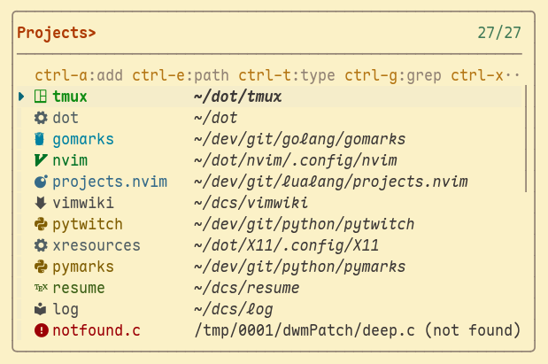
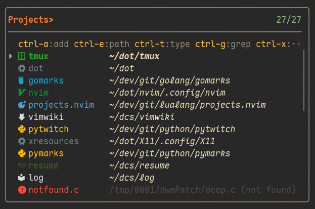

# Projects fzf

[](#)
[](#)


<p align="center">
    
</p>

<p align="center">~ A project manager with icons, grep support, and per-project type configuration ~<p>

## Dependencies

- [`neovim`](https://github.com/neovim/neovim/releases) <small>version >=</small> `0.9.0`
- [`fzf-lua`](https://github.com/ibhagwan/fzf-lua) <small>neovim plug-in</small>

## Features

- **Icons Support**
- **Fuzzy grep/search** inside a project
- **Assign project types** (e.g. `lua`, `cpp`, `golang`) to enable file-type specific icons.

## Installation

### [lazy.nvim](https://github.com/folke/lazy.nvim)

```lua
{
  'mateconpizza/projects.nvim',
  dependencies = {
    "ibhagwan/fzf-lua",
    -- optional: add file icons support
    "nvim-tree/nvim-web-devicons",  -- or use 'nvim-mini/mini.icons'
  },
  ---@module 'projects'
  ---@type projects.opts
  opts = {},
  keys = {
    { '<leader>sp', '<CMD>FzfLuaProjects<CR>', desc = 'search projects' },
  },
  enabled = true,
}
```

<details>
<summary><strong>Default configuration</strong></summary>

```lua
-- There's no need to include this in setup(). It will be used automatically.
require('projects').setup({
  name = 'projects.nvim', -- plugin name
  cmd = 'FzfLuaProjects', -- `user-command` in neovim.
  prompt = 'Projects> ', -- fzf's prompt

  -- enable color output
  color = true,

  -- icons
  icons = {
    enabled = true,
    default = '', -- icon for items without type
    warning = '', -- icon for items not found or with errors
    color = nil, -- default color for items without type (type: default)
  },

  -- file store ($XDG_DATA_HOME/nvim or ~/.local/share/nvim)
  fname = vim.fn.stdpath('data') .. '/projects.json',

  -- keybinds
  keymap = {
    add = 'ctrl-a', -- add project
    edit_path = 'ctrl-e', -- edit project's path
    edit_type = 'ctrl-t', -- edit project's type (lua, cpp, python, etc)
    grep = 'ctrl-g', -- grep inside project
    remove = 'ctrl-x', -- remove project
    rename = 'ctrl-r', -- rename project
    restore = 'ctrl-u', -- undo last action
  },
})
```

</details>

<details>
<summary><strong>Dark mode screenshot</strong></summary>

<div>
    <p align="center">
        
    </p>
</div>

</details>
